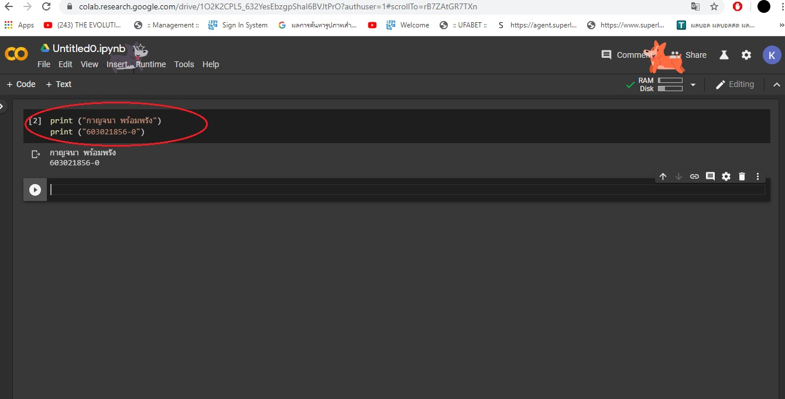

# python_dataviz
# นางสาวกาญจนา พร้อมพรั่ง
# 603021856-0
## การติดตั้งโปรแกรม Miniconda
## 1.	ทำการดาวน์โหลดโปรแกรม Miniconda (ลิงค์ดาวน์โหลด : https://docs.conda.io/en/latest/miniconda.html) แล้วคลิ๊กเลือก Windows installers ตามเครื่องพิวเตอร์ของเรา ดังรูป

## 2. ทำการติดตั้งโปรแกรม แล้วคลิ๊กตามรูปภาพ

### ทำการติดตั้งโปรแกรม Mimiconda สำเร็จ

## 3. ทำการเปิดโปรแกรม Anaconda Prompt (Miniconda3)

### (1) เช็คเวอร์ชั่นของโปรแกรม 
### (2) ปิดการทำงานของโปรแกรม
### (3) ทำการ Install Matplotlib

### ทำการ Install Jupyter

### เรียกใช้งาน Jupyter notebook

### คลิ๊กตามรูปภาพ เพื่อเริ่มเขียนโค้ด

### ทำการรันโค้ด แล้วกด Save

ทำการ Save งานสำเร็จ

## 4.	ทำการดาวน์โหลดโปรแกรม Google Colab (ลิงค์ดาวน์โหลด : https://www.google.com/search?q=google+colab&rlz=1C1RRWD_enTH724TH725&oq=google+co&aqs=chrome.1.69i57j0l4j69i60l3.7330j1j7&sourceid=chrome&ie=UTF-8) แล้วคลิ๊กเลือก ดังรูป

เปิดใช้งาน NEW PYTHON 3 NOTEBOOK

### ทำการรันโค้ด

## 5.	ดาวน์โหลดโปรแกรม GitHub (ลิงค์ดาวน์โหลด : https://github.com/) ทำการ Sign up เพื่อสร้าง account หากมีบัญชี (account) อยู่แล้วให้คลิ๊กเลือก Sign in

### กรอก Username และ Password

### ไปที่ New repository เพื่อสร้างไฟล์ GitHub ใหม่

### เลือก Public เพื่อตั้งค่าให้คนอื่นสามารถเข้ามาดูผลงานของเราได้ แล้วคลิ๊ก Create repository ดังรูป

### จะได้ชื่อของ Repository

### ไปที่ลิงค์ https://www.google.com/search?q=git+anaconda+install&rlz=1C1RRWD_enTH724TH725&oq=git+anaco&aqs=chrome.2.69i57j0l5j69i60j69i61.12810j1j4&sourceid=chrome&ie=UTF-8 เพื่อ Copy Code มา Install ใน anaconda

### ทำการ Install ดังรูป

### การติดตั้งโปรแกรม Virsual studio Code (ลิงค์ดาวน์โหลด : https://www.google.com/search?rlz=1C1RRWD_enTH724TH725&sxsrf=ACYBGNQzEKN1J0haOaHSU6WDmZo9diAVHw%3A1578330131290&ei=E2gTXou6Ec7Uz7sPmcGJ8AE&q=visual+studio+code&oq=Visual+Studio&gs_l=psy-ab.1.2.0i71l8.0.0..12025...0.3..0.0.0.......0......gws-wiz.vMPDhGQETCY ) ทำการคลิ๊ก ดังรูป

### ทำการติดตั้งสำเร็จ

### หน้าตาโปรแกรม Virsual studio Code 

### เข้าโปรแกรม Miniconda เพื่อ Install Git ลงใน Miniconda แล้วคลิ๊ก ดังรูป 

### ทำการเชื่อมโปรแกรม Minianacoda กับ Github เพื่อให้ไฟล์สามารถเชื่อมกันได้ ส่วน Dir เพื่อดูว่ามีไฟล์อะไรที่อยู่ในโปรแกรมเราบ้าง

### Git Status เพื่อดูว่ามีไฟล์ใดบ้าง ที่ยังไม่ได้เอาเข้าในโปรแกรม หรือเพื่อดูว่าไฟล์ไหนที่เราต้องการจะเอาเข้าโปรแกรม

### ทำ Git add เพื่อเอาไฟล์ที่เราต้องการเข้าโปรแกรม ส่วน Git commit เป็นการบอกรายละเอียดไฟล์ของเราที่ใช้แสดงบน Internet และ Git push การอัปโหลดไฟล์เพื่อเชื่อมบน Internet
